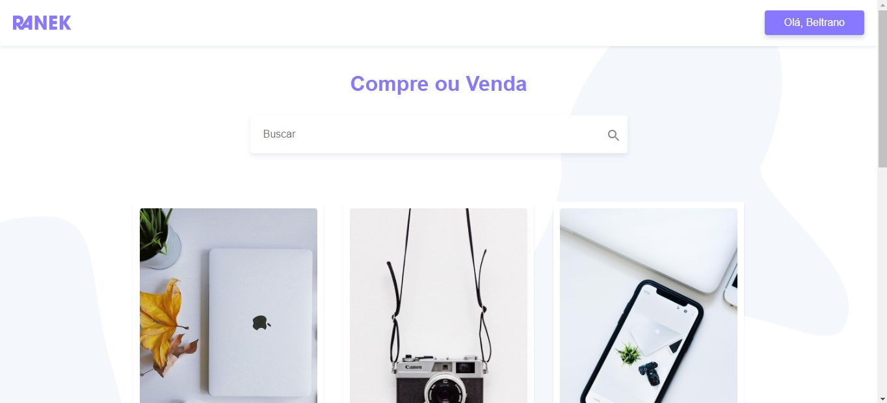

# Ranek

Projeto realizado durante o curso de Vue.js da Origamid.  
Se trata de um e-commerce de eletrônicos, utilizando Vue.js e Javascript.

## Project setup
```
npm install
```
### Compiles and hot-reloads for development
```
npm run serve
```

## Implementações futuras
- Integração com API do Wordpress.
- Cadastro de fotos dos produtos pelo usuário.
- Funcionalidade (esqueceu a senha)
## Capturas 




